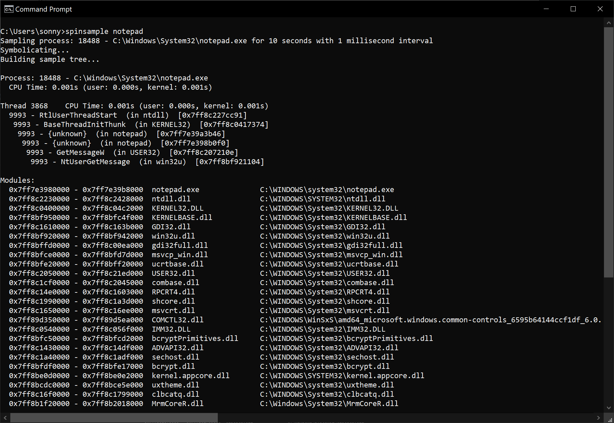

# SpinSample
Process sampling profiler for Windows, inspired by macOS `sample` and `spindump` tools.



## Usage

`spinsample --help`

```
Usage: spinsample <PROCESS> [DURATION] [INTERVAL] [Options]

Arguments:
  <PROCESS>   The process pid or name to sample
  [DURATION]  Duration in seconds, default is 10
  [INTERVAL]  Sampling interval in milliseconds, default is 1

Options:
  -w, --wait           Wait until the specified process exists, then start sampling
  -e, --edit [<EDIT>]  Open the output file using the optionally specified editor
  -h, --help           Print help
```
